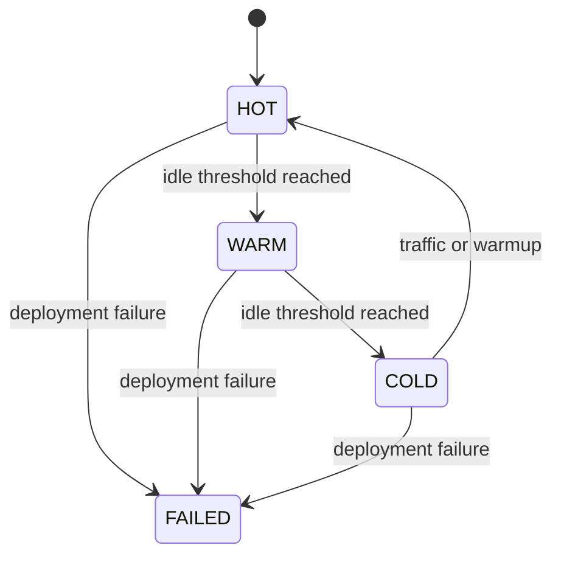

# 08 Lifecycle Design

## States

- `HOT`
- `WARM`
- `COLD`
- `FAILED`

## Intent

Lifecycle state expresses deployment readiness and cost posture. Routing can prefer active deployments while reconciliation policies can cool idle ones.

## Current Policy

- `HOT` after recent use
- `WARM` after the warm threshold
- `COLD` after the cold threshold
- `FAILED` reserved for backend or policy failures

## State Diagram

## Future Work

- background reconciliation loop
- scheduled warm pools
- tenant-specific lifecycle policy
